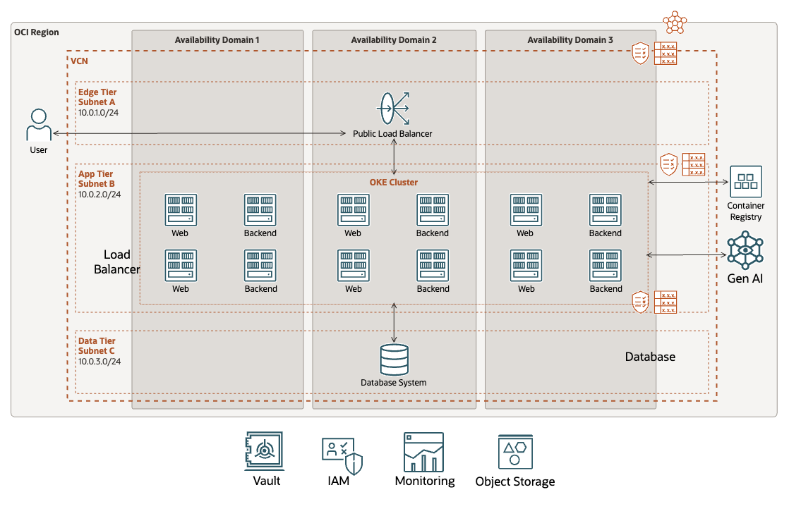

# Accelerating AI Application Deployment Using Cloud Native Strategies

## Introduction

Kubernetes has become the standard for managing containerized applications, and Oracle Cloud Infrastructure Container Engine for Kubernetes (OKE) is a managed Kubernetes service that delivers outstanding cloud reliability. Now, imagine using OKE with AI to create powerful, scalable, highly available AI applications.

This project deploys an AI pipeline with a multipurpose front end for text generation and summarization. The pipeline integrates with a database to track interactions, enabling fine-tuning and performance monitoring for application optimization. It leverages OCI Generative AI APIs on a Kubernetes cluster.

## Getting Started

### 0. Prerequisites and setup

- Oracle Cloud Infrastructure (OCI) Account - [sign-up page](https://www-sites.oracle.com/artificial-intelligence/solutions/deploy-ai-apps-fast/#:~:text=Oracle%20Cloud%20account%E2%80%94-,sign%2Dup%20page,-Oracle%20Cloud%20Infrastructure)
- Oracle Cloud Infrastructure (OCI) Generative AI Service - [Getting Started with Generative AI](https://docs.oracle.com/en-us/iaas/Content/generative-ai/getting-started.htm)
- Oracle Cloud Infrastructure Documentation - [Generative AI](https://docs.oracle.com/en-us/iaas/Content/generative-ai/home.htm)
- Oracle Cloud Infrastructure (OCI) Generative AI Service SDK - [Oracle Cloud Infrastructure Python SDK](https://pypi.org/project/oci/)
- Node v16 - [Node homepage](https://nodejs.org/en)
- Oracle JET v15 - [Oracle JET Homepage](https://www.oracle.com/webfolder/technetwork/jet/index.html)
- OCI Container Engine for Kubernetes — [documentation](https://www-sites.oracle.com/artificial-intelligence/solutions/deploy-ai-apps-fast/#:~:text=Engine%20for%20Kubernetes%E2%80%94-,documentation,-Oracle%20Autonomous%20Database)
- Oracle Autonomous Database — [documentation](https://www-sites.oracle.com/artificial-intelligence/solutions/deploy-ai-apps-fast/#:~:text=Oracle%20Autonomous%20Database,Boot%20framework%E2%80%94documentation)
- Spring Boot framework — [documentation](https://www-sites.oracle.com/artificial-intelligence/solutions/deploy-ai-apps-fast/#:~:text=Spring%20Boot%20framework%E2%80%94-,documentation,-Getting%20started)



Get troubleshoot help on the [FAQ](FAQ.md)

## Requirements

You need to be and administrator.

> If not should should have enough privileges for OKE, Network, and Database services. Plus others like tenancy inspeact. See example:
>
> ```
> Allow group 'Default'/'GroupName' to inspect tenancies in tenancy
> ```

## Set Up environment

On Cloud Shell, clone the repository:

```bash
git clone https://github.com/oracle-devrel/oci-generative-ai-jet-ui.git
```

Change to the new folder:

```bash
cd oci-generative-ai-jet-ui
```

Install Node.js 16 on Cloud Shell.

```bash
nvm install 18 && nvm use 18
```

Install dependencies for scripts.

```bash
cd scripts/ && npm install && cd ..
```

### Set the environment variables

Generate `genai.json` file with all environment variables.

```bash
npx zx scripts/setenv.mjs
```

> Answer the Compartment name where you want to deploy the infrastructure. Root compartment is the default.

### Deploy Infrastructure

Generate `terraform.tfvars` file for Terraform.

```bash
npx zx scripts/tfvars.mjs
```

```bash
cd deploy/terraform
```

Init Terraform providers:

```bash
terraform init
```

Apply deployment:

```bash
terraform apply --auto-approve
```

```bash
cd ../..
```

## Release and create Kustomization files

Build and push images:

```bash
npx zx scripts/release.mjs
```

Create Kustomization files

```bash
npx zx scripts/kustom.mjs
```

### Kubernetes Deployment

```bash
export KUBECONFIG="deploy/terraform/generated/kubeconfig"
```

```bash
kubectl cluster-info
```

```bash
kubectl apply -k deploy/k8s/overlays/prod
```

Run `get deploy` a few times:

```bash
kubectl get deploy
```

Wait for all deployments to be `Ready` and `Available`.

```
NAME      READY   UP-TO-DATE   AVAILABLE   AGE
backend   1/1     1            1           3m28s
web       1/1     1            1           3m21s
```

Access your application:

```bash
echo $(kubectl get service \
  -n ingress-nginx \
  -o jsonpath='{.items[?(@.spec.type=="LoadBalancer")].status.loadBalancer.ingress[0].ip}')
```

> This command will list the services on the `ingress-nginx` namespace and filter for the Load Balancer. If the response is an empty string, wait a bit and execute the command again. The Load Balancer takes a bit of time to create the Public IP address.

Take the Public IP to your browser.

## Clean up

Delete Kubernetes components

```bash
kubectl delete -k deploy/k8s/overlays/prod
```

Destroy infrastructure with Terraform.

```bash
cd deploy/terraform
```

```bash
terraform destroy -auto-approve
```

```bash
cd ../..
```

Clean up the artifacts on Object Storage

```bash
npx zx scripts/clean.mjs
```

## Local deployment

Run locally with these steps [Local](LOCAL.md)
