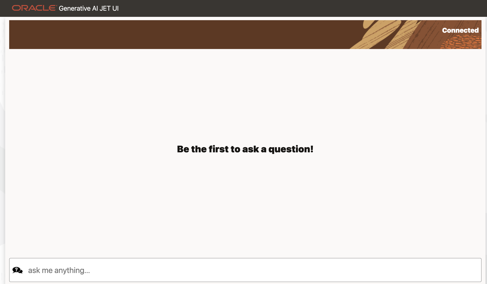
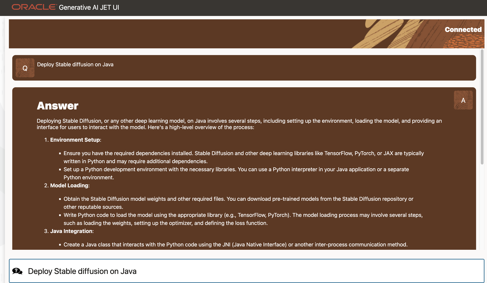
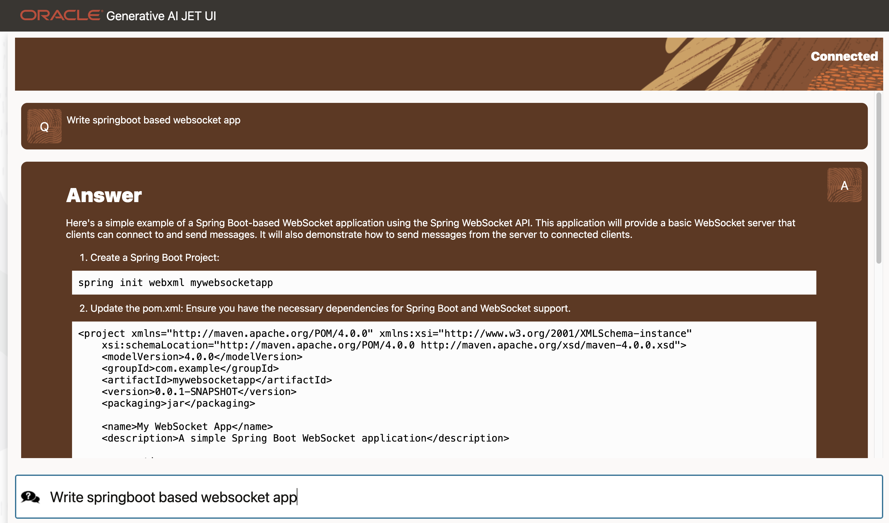

# oci-generative-ai-jet-ui

[](https://img.shields.io/badge/license-UPL-green) [](https://sonarcloud.io/dashboard?id=oracle-devrel_oci-generative-ai-jet-ui)

## Introduction

Using Oracle JET, create a user-friendly prompt-led user interface (UI) to interact with Oracle's new Generative AI service. This toolkit will configure your Generative AI Service connection so you can begin your journey with AI, or migrate your existing (local or Cloud) LLMs to the Oracle AppDev ecosystem.

Oracle JET(Preact) allows you to craft pixel-perfect UI's which are fast, lightweight, and engaging. Your code takes center stage with Oracle JET, while its powerful features enable you to create dynamic user experiences quickly and reliably.

Oracle's Generative AI service allows developers to unlock a better user experience for chat systems, question and answer solutions, and much more. This project provides a front end to that service so you can experiment and get a sense of the immense power of Oracle Generative AI. This is an excellent starting point on your AI journey, and experienced developers will be able to quickly port their LLMs to leverage this powerful service for enhanced customer support solutions.  



## Getting Started

### 0. Set up  

```text
Follow links below to generate a config file and a key pair in your ~/.oci directory
https://docs.oracle.com/en-us/iaas/Content/API/Concepts/sdkconfig.htm
https://docs.oracle.com/en-us/iaas/Content/API/Concepts/apisigningkey.htm
https://docs.oracle.com/en-us/iaas/Content/API/SDKDocs/cliinstall.htm#configfile

After completion, you should have following 2 things in your ~/.oci directory 

a. A config file(where key file point to private key:key_file=~/.oci/oci_api_key.pem)
b. A key pair named oci_api_key.pem and oci_api_key_public.pem

Now make sure you change the reference of key file in config file (where key file point to private key:key_file=/YOUR_DIR_TO_KEY_FILE/oci_api_key.pem)
```

- Append OCI Generative-AI service compartment and endpoint URL  
`vim service/python/server.py`

```Python
#TODO: Update this section with your tenancy details
compartment_id = "ocid1.compartment.oc1.."
CONFIG_PROFILE = "DEFAULT"
config = oci.config.from_file("~/.oci/config", CONFIG_PROFILE)
endpoint = "https://inference.generativeai.<REGION>.oci.oraclecloud.com"
generative_ai_inference_client = (
    oci.generative_ai_inference.GenerativeAiInferenceClient(
        config=config,
        service_endpoint=endpoint,
        retry_strategy=oci.retry.NoneRetryStrategy(),
        timeout=(10, 240),
    )
)
```

### 1. (Optional)Modify websocket ports  

- In root of project directory run to edit ports  
`vim app/web/components/content/index.tsx`

```Javascript
const gateway = `ws://${window.location.hostname}:1234`;
```

- Update default port in Python websocket server:  
`vim service/python/server.py`

```Python
async def start_server():
    await websockets.serve(handle_websocket, "localhost", 1234 )
```

### 2. Upload Public Key

```text
# Upload your oci_api_key_public.pem to console:
https://docs.oracle.com/en-us/iaas/Content/API/Concepts/apisigningkey.htm#three
```

### 3. Make sure you have python installed on your machine

- In cli run following command to validate Python version  
`python --version`

You should see similar output:

```shell
Python 3.8.3
```

### 4. Install all dependencies(include our beta version SDK)  

We suggest you install dependencies in a virtual env to avoid conflicts on your system.  

- Navigate to the server root folder  
`cd /service/python`  
- Create vitrual environment:  
`python3 -m venv venv`  
- Activate your virtual environment:  
`. venv/bin/activate`  
- Upgrade pip:  
`pip install --upgrade pip`  
- Install requirements:  
`pip install -r requirements.txt`

## 5. Start Python server websocket app  

Once dependencies are installed and your service credentials are updated you can run server.py  

- `python server.py`  

## 6. Start JET Client

- Open app directory:  
  `cd app/`  
- Install dependencies:  
  `ojet restore`  
- Run local version:  
  `ojet serve`  
- Or package for web deployment  
  `ojet build web`

Ask you questions to generate AI response


Note that app is capable of generating markdown


## Appendix: Token-based Authentication

Check [Token-based Authentication for the CLI](https://docs.oracle.com/en-us/iaas/Content/API/SDKDocs/clitoken.htm#Running_Scripts_on_a_Computer_without_a_Browser)
if need to run testing with session token via BOAT. Here is the sample config to setup client with session token in the test scripts:

```Python
config = oci.config.from_file('~/.oci/config', profile_name="DEFAULT")

def make_security_token_signer(oci_config):
    pk = oci.signer.load_private_key_from_file(oci_config.get("key_file"), None)
    with open(oci_config.get("security_token_file")) as f:
        st_string = f.read()
    return oci.auth.signers.SecurityTokenSigner(st_string, pk)

signer = make_security_token_signer(oci_config=config)
# Service endpoint
endpoint = "https://generativeai.aiservice.<Region>.oci.oraclecloud.com"

generative_ai_client = oci.generative_ai.generative_ai_client.GenerativeAiClient(config=config, service_endpoint=endpoint, retry_strategy=oci.retry.NoneRetryStrategy(), signer=signer)
```

### Prerequisites

- OCI Account
- OCI Generative Service
- Oracle JET
- Python3

## Notes/Issues

Additional Use Cases like summarization and embedding coming soon.

To change output parameters edit server.py

```Python
    cohere_generate_text_request.max_tokens = 500 # choose number of tokens 1-4000
    cohere_generate_text_request.temperature = 0.75 # adjust temperature
    cohere_generate_text_request.top_p = 0.7 # adjust top_p
    cohere_generate_text_request.frequency_penalty = 1.0 # adjust frequency_penalty
```

## URLs
* developer.oracle.com/ai
* oracle.com/ai

## Contributing
This project is open source.  Please submit your contributions by forking this repository and submitting a pull request!  Oracle appreciates any contributions that are made by the open source community.

## License
Copyright (c) 2024 Oracle and/or its affiliates.

Licensed under the Universal Permissive License (UPL), Version 1.0.

See [LICENSE](LICENSE) for more details.

ORACLE AND ITS AFFILIATES DO NOT PROVIDE ANY WARRANTY WHATSOEVER, EXPRESS OR IMPLIED, FOR ANY SOFTWARE, MATERIAL OR CONTENT OF ANY KIND CONTAINED OR PRODUCED WITHIN THIS REPOSITORY, AND IN PARTICULAR SPECIFICALLY DISCLAIM ANY AND ALL IMPLIED WARRANTIES OF TITLE, NON-INFRINGEMENT, MERCHANTABILITY, AND FITNESS FOR A PARTICULAR PURPOSE.  FURTHERMORE, ORACLE AND ITS AFFILIATES DO NOT REPRESENT THAT ANY CUSTOMARY SECURITY REVIEW HAS BEEN PERFORMED WITH RESPECT TO ANY SOFTWARE, MATERIAL OR CONTENT CONTAINED OR PRODUCED WITHIN THIS REPOSITORY. IN ADDITION, AND WITHOUT LIMITING THE FOREGOING, THIRD PARTIES MAY HAVE POSTED SOFTWARE, MATERIAL OR CONTENT TO THIS REPOSITORY WITHOUT ANY REVIEW. USE AT YOUR OWN RISK. 