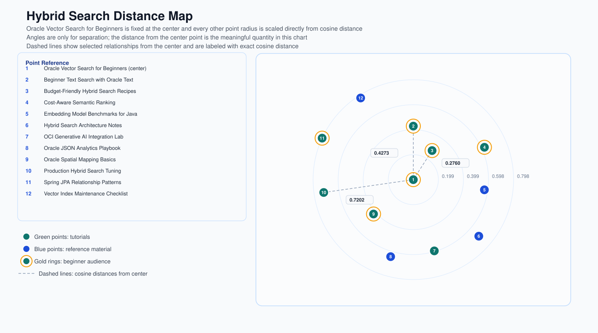

# JDBC Hybrid Search

This module demonstrates hybrid search with plain JDBC on Oracle AI Database. The sample stores product-style documents with:

- a text content field that is embedded locally with the same MiniLM model style used in `ai-vector-search`
- a JSON resource file that seeds a larger sample catalog dynamically at runtime
- a `VECTOR` embedding column for semantic similarity
- relational columns such as `category` and `price`
- a JSON metadata document for attributes like `audience` and `topics`
- a generated SVG distance map that visualizes cosine distance from the center tutorial

The search query combines all three in one statement:

- rank rows with `VECTOR_DISTANCE`
- filter by relational predicates
- filter by JSON metadata using `JSON_VALUE` and `JSON_EXISTS`

The sample also writes an SVG diagram that arranges documents around a center tutorial. Each point radius is scaled from cosine distance, while angle is used only to separate labels visually. The distance map is a visualization only, not a replacement for the original vector search.

## Run the test

```bash
mvn test
```

The test starts Oracle AI Database Free with Testcontainers and runs the sample end to end. You should see output similar to the following:

```
Loaded documents: 12
Hybrid search for: oracle jdbc vector search for beginners
Oracle Vector Search for Beginners | category=tutorial | price=0.00 | audience=beginner | score=0.7782
Budget-Friendly Hybrid Search Recipes | category=tutorial | price=29.00 | audience=beginner | score=0.7037
Hybrid search diagram written to: ./jdbc-hybrid-search/hybrid-search-diagram.svg
```

The sample recreates the schema, loads the JSON catalog, runs a hybrid search for beginner vector-search tutorials, and writes an SVG diagram to `jdbc-hybrid-search/hybrid-search-diagram.svg`. In that distance map, point `1` is always the center tutorial.




## Run the sample with your own database

From this app directory (`apps/jdbc-hybrid-search`):

```bash
mvn compile exec:java -Dexec.args="jdbc:oracle:thin:@localhost:1521/freepdb1 testuser testpwd"
```
