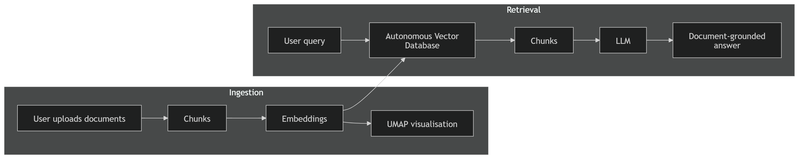
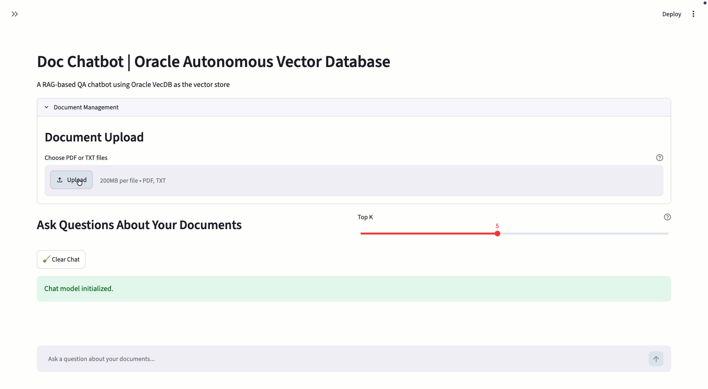
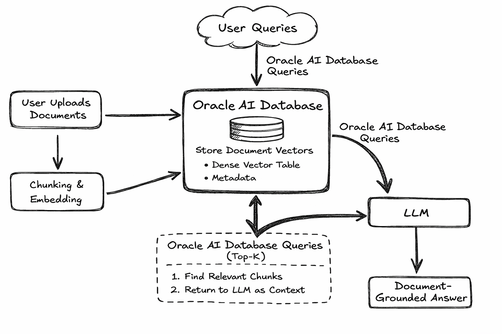
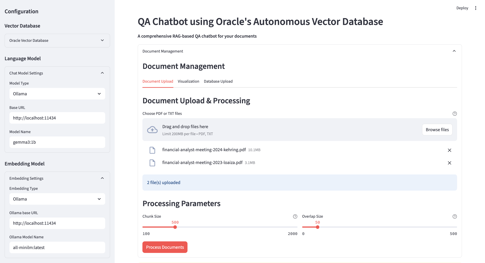
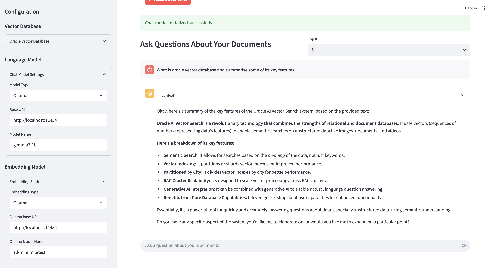

# Doc Chatbot | RAG-based QA with Oracle Autonomous Vector Database (VecDB SDK)

## Overview

This app showcases a Retrieval-Augmented Generation (RAG) QA chatbot that allows you to upload documents, process them, and interactively ask questions. It is built using Oracle's VecDB Python SDK. The app supports multiple LLM and embedding backends, including Ollama and OpenAI-compatible APIs.

Oracle VecDB acts as the retrieval backbone of the workflow: document chunks are embedded, stored as dense vectors together with metadata, and queried at runtime using top-k similarity search. The retrieved chunk context is then passed into the configured chat model to generate grounded answers.

---

## What you can do with this app

- Upload PDF or TXT documents and convert them into vectorized knowledge
- Store chunk embeddings and metadata in Oracle VecDB
- Ask grounded questions over uploaded content using a RAG workflow
- Switch between multiple chat and embedding backends
- Inspect retrieved context used for answer generation

<p align="center">
  
</p>
<p align="center"><em>High-level document ingestion and retrieval flow using Oracle VecDB.</em></p>

## 

## Architecture Flow

1. Users upload PDF or TXT documents through the Streamlit interface.
2. The application extracts raw text from each file and splits it into smaller chunks.
3. An embedding model generates vector representations for every chunk.
4. The chunk embeddings and metadata are uploaded into an Oracle VecDB dense vector table.
5. When the user asks a question, the question is embedded using the configured embedding backend.
6. The app retrieves the top-k most relevant chunks from Oracle VecDB.
7. The retrieved chunks are passed as context to the configured chat model.
8. The model generates a final answer grounded in the uploaded document content.

---

## Why Oracle AI Database in this sample

This sample highlights Oracle AI Database as the vector retrieval layer of the application. Oracle VecDB is used to store chunk embeddings as dense vectors, manage the vector table lifecycle, and perform top-k similarity retrieval at query time. The retrieved database context is then passed into the selected chat model to produce grounded answers.

<p align="center">
  
</p>
<p align="center"><em>Oracle AI Database-centered retrieval architecture for document-grounded question answering.</em></p>

---

## Features

- **Oracle VecDB integration**: Store chunk embeddings and metadata in Oracle VecDB through the VecDB SDK
- **Vector table lifecycle management**: Recreate the target vector table and attempt vector index creation before uploading records
- **Document ingestion**: Upload and process PDF and TXT files directly from the UI
- **Chunk-based indexing**: Split documents into configurable chunks with overlap
- **Configurable chunking**: Adjust chunk size and overlap before generating embeddings
- **RAG-based question answering**: Retrieve relevant document chunks and use them as context for answer generation
- **Multiple chat backends**: Use either Ollama or OpenAI-compatible API endpoints for response generation
- **Multiple embedding backends**: Generate embeddings with Sentence-Transformers, Ollama, or OpenAI-compatible APIs
- **Interactive Streamlit UI**: Configure the pipeline, upload documents, inspect retrieved context, and chat in one interface

---

## Prerequisites

- Python 3.10+
- Streamlit
- Access to Oracle AI Database (26ai) with Vector capabilities exposed via ORDS (VecDB API)
  - An ORDS-exposed Oracle VecDB endpoint reachable from the machine running the app
  - ORDS VecDB base URL (e.g. `https://<host>/ords/vector3/_/db-api/stable/vecdb`)
  - Database username and password for a user/schema with vector privileges (e.g. VECTOR3)
- Ollama (for local LLM/embeddings) OR API from LLM providers (like OpenAI, Openrouter, etc.)

---

## Installation

1. Clone this repository

   ```bash
   git clone <repo-url>
   cd doc_chatbot
   ```

2. (Recommended) Create and activate a virtual environment

   ```bash
   python3 -m venv venv
   source venv/bin/activate
   ```

3. Install dependencies
   ```bash
   pip install -r requirements.txt
   ```

---

## Usage

1. Run the application

   ```bash
   streamlit run app/main.py
   ```

   The app will open at http://localhost:8501

2. Configure the sidebar
   - Vector Store (Oracle VecDB):
     - ORDS VecDB Base URL: e.g. `https://<host>/ords/vector3/_/db-api/stable/vecdb`
     - Database Username: your vector user
     - Password: your password
     - Click "Test Connection"
   - Language Model: Choose your preferred chat model (OpenAI-compatible API or Ollama)
   - Embedding Model: Select embedding generation method (Sentence-Transformers, OpenAI-compatible API, or Ollama)

  <p align="center">
  
</p>
<p align="center"><em>Application setup, document upload, and chunk processing configuration.</em></p>

3. Upload Documents and Start Chatting
   - Document Upload: Process and chunk your documents
   - Database Upload: Store processed document vectors in Oracle VecDB (a vector table will be created and populated)
   - Main Chat Interface: Ask questions about your documents
   - Vector Table Name: Enter the target table name before processing the uploaded chunks
   - Processing Parameters: Configure chunk size and overlap size before vectorization
   - Clicking **Process Documents** extracts text from the uploaded files, splits the content into chunks, generates embeddings, recreates the target Oracle VecDB table, attempts to create a vector index, and uploads chunk vectors together with metadata.

  <p align="center">
  
</p>
<p align="center"><em>Interactive question answering over uploaded documents using context retrieved from Oracle VecDB.</em></p>

---

## How it works (VecDB Integration)

- Connection validation:
  - Initializes the Oracle VecDB client and validates connectivity with `describe_vector_database()`
- Table management:
  - Attempts to drop the existing vector table: `drop_vector_table(table_name=...)`
  - Creates a new dense vector table: `create_vector_table(table_name=..., vector_type="dense")`
  - Attempts to create a vector index: `create_index(table_name=...)`
- Upsert vectors:
  - Uploads chunk records in the form `{"id": "...", "dense_vector": [...], "metadata": {...}}`
- Query-time retrieval:
  - Sends the query embedding to Oracle VecDB and retrieves the top-k closest chunk matches
- Stored metadata:
  - Each chunk record stores metadata such as `source`, `text`, and `chunk_id`

See the implementation in `app/main.py`.

---

## Stored Vector Payload

Each processed chunk is uploaded into Oracle VecDB as a dense vector record with:

- `id`: generated chunk vector identifier
- `dense_vector`: embedding array generated for the chunk text
- `metadata.source`: original uploaded file name
- `metadata.text`: chunk text used later as retrieval context
- `metadata.chunk_id`: chunk sequence number within the source document

This payload structure enables Oracle VecDB to support both semantic retrieval and metadata-aware context reconstruction for the final answer generation step.

---

## File Structure

```
doc_chatbot/
├── app/
│   ├── main_vecdb.py
│   └── utility/
│       ├── document_processor.py
│       └── model.py
├── images/
│   ├── chat.png
│   ├── diagram.png
│   ├── diagram2.png
│   └── upload.png
├── README.md
├── requirements.txt
└── venv/               # optional, if you created one
```

---

## Configuration

### Vector Database (Oracle VecDB via ORDS)

- Provide the ORDS VecDB base URL, DB username, and password in the sidebar
- Click **Test Connection** to validate connectivity

### Language Model

- **Ollama**: Local Ollama-compatible chat models
- **OpenAI-compatible API**: Remote chat model endpoints

### Embedding Model

- **Sentence-Transformers**: Local sentence-transformers models
- **Ollama**: Local embedding generation through Ollama
- **OpenAI-compatible API**: Remote embedding model endpoints

---

## Current Limitations

- The current ingestion flow supports PDF and TXT files only
- PDF extraction depends on text being extractable from the file via PyPDF2
- Reprocessing documents recreates the target vector table
- Retrieval quality depends on the selected embedding backend, chunk size, overlap size, and source document quality

---

## Troubleshooting

- Ensure your Python version and packages match the requirements
- Verify ORDS endpoint, credentials, and network access to the database
- For Ollama, ensure the Ollama server is running locally
- If document processing fails, verify that the selected embedding backend is correctly configured
- If no text is extracted from a PDF, the document may contain scanned pages or non-extractable text
- If no relevant chunks are returned, verify that documents were successfully uploaded into the selected Oracle VecDB table

---
