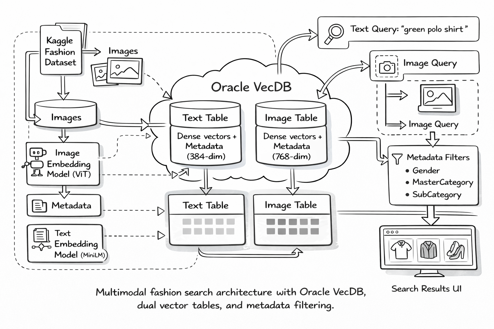
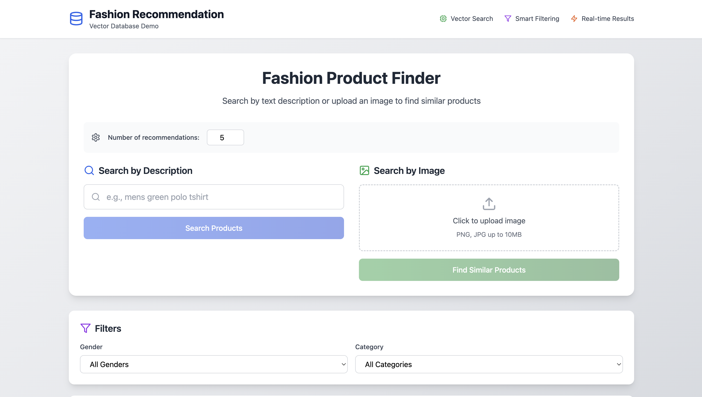

# Fashion Product Search | Multimodal Semantic Search with Oracle VecDB

A full‑stack application for searching and recommending fashion products using **semantic vector search** over images and text.

## 🚀 Overview
- Search products via **text description** or **uploaded image**.
- Rank results by vector similarity (cosine) and display rich product metadata.
- Built with **FastAPI** backend (Python), **Oracle VecDB** vector DB, and **React** frontend.
- Uses two embedding models:
  - **Images:** `google/vit-base-patch16-224-in21k` (ViT‑Base, 768‑dim)
  - **Text:** `sentence-transformers/all-MiniLM-L6-v2` (384‑dim)
- Datasets (Kaggle; choose at index time):
  - SMALL (low‑res, quick start): `paramaggarwal/fashion-product-images-small`
  - HIGH (high‑res, full set): `paramaggarwal/fashion-product-images-dataset`

Oracle VecDB acts as the retrieval layer of the application. Image embeddings and text embeddings are stored in separate dense vector tables, and query-time similarity search is combined with metadata filtering to return relevant fashion products in real time.

---

## 🧭 Architecture Flow

1. The indexing pipeline downloads and prepares the fashion dataset from Kaggle.
2. Product metadata is merged with image files from the dataset.
3. Image embeddings are generated with ViT and stored in an Oracle VecDB image table.
4. Text embeddings are generated from product titles with Sentence-Transformers and stored in an Oracle VecDB text table.
5. Users can search either by text description or by uploading an image.
6. Oracle VecDB performs top-k similarity search against the appropriate vector table.
7. Optional metadata filters such as gender, masterCategory, and subCategory are applied server-side.
8. The backend returns ranked products with metadata and image URLs for frontend display.

<p align="center">
  
</p>

---

## Why Oracle VecDB in this sample

This sample uses Oracle VecDB as the vector retrieval backbone for both text-based and image-based fashion search. Separate dense vector tables are used for each modality, while shared metadata enables consistent filtering and product presentation across both search modes.

---

## 💡 Features
- **Image-to-image search**: Retrieve visually similar fashion products
- **Text-to-product search**: Retrieve products matching a natural-language description
- **Top-K retrieval**: Configure the number of returned results
- **Metadata filtering**: Filter by fields such as `gender`, `masterCategory`, and `subCategory`
- **Dual vector indexes**: Use separate Oracle VecDB tables for image and text embeddings
- **Kaggle dataset indexing pipeline**: Download, clean, embed, and upsert product data into Oracle VecDB
- **Image serving endpoint**: Stream product images from backend metadata and local dataset paths

---

## Pre‑Installation
Ensure you have your **Kaggle API key** set up and the Kaggle CLI (or `kagglehub`) working to download datasets before proceeding.

---

## 🛠️ Configuration
Oracle VecDB configuration is controlled via environment variables.

### VecDB environment variables

1. Copy `backend/.env.example` to `backend/.env`.
2. Replace the placeholder `VECDB_REST_URL`, `VECDB_USERNAME`, and `VECDB_PASSWORD` entries with your real VecDB endpoint and credentials.
3. Keep `backend/.env` out of source control.

`config.py` loads these values automatically:

```python
from dotenv import load_dotenv
load_dotenv(override=True)

ORACLE_VECDB_REST_URL = os.getenv("VECDB_REST_URL")
ORACLE_USERNAME = os.getenv("VECDB_USERNAME")
ORACLE_PASSWORD = os.getenv("VECDB_PASSWORD")
ORACLE_ACCESS_TOKEN = os.getenv("VECDB_ACCESS_TOKEN")
```

You can still override other settings (e.g., `ORACLE_IMAGE_TABLE`, `ORACLE_TEXT_TABLE`) via environment variables if needed.

This is also how the backend switches between the SMALL and HIGH Oracle VecDB tables at runtime.

---

## 🛠️ Installation

### Backend Setup (FastAPI + Oracle VecDB)
**Requirement:** Python **3.10+**
```bash
python3 -m venv .venv
source .venv/bin/activate
pip install -r requirements.txt
```

### Frontend Setup (React/Vite)
```bash
cd frontend
npm install
```


## 🔄 Run (Small by default, High on demand)

### Dataset Mode Selection

The application supports two dataset modes:
- **SMALL** for faster local testing and lighter indexing
- **HIGH** for a larger and higher-resolution fashion dataset

The selected mode determines which Oracle VecDB image and text tables are used by the backend.

### 1) Index SMALL (default)
```bash
cd backend
python load_dataset.py --dataset small
```
**Notes**
- Downloads SMALL (low‑res) from Kaggle, embeds, and upserts into `FASHION_IMAGE_SMALL` / `FASHION_TEXT_SMALL`.

### 2) Start Backend (SMALL)
```bash
BACKEND_ORIGIN=http://<your_vm_ip_addrs>:8000 uvicorn main:app --host 0.0.0.0 --port 8000
```
The backend defaults to SMALL tables in `backend/config.py`.

### 3) Start Frontend
```bash
cd frontend
VITE_API_URL=http://<your_vm_ip_addrs>:8000 npm run dev -- --host 0.0.0.0 --port 5173
```

### Use HIGH (high‑resolution) instead
1. Index HIGH once:
```bash
cd backend
python load_dataset.py --dataset high
```
2. Start backend pointing to HIGH tables (inline env for a one‑off switch):
```bash
ORACLE_IMAGE_TABLE=FASHION_IMAGE_HIGH ORACLE_TEXT_TABLE=FASHION_TEXT_HIGH \
  BACKEND_ORIGIN=http://<your_vm_ip_addrs>:8000 uvicorn main:app --host 0.0.0.0 --port 8000
```
3. Frontend: refresh the browser (or start with `VITE_API_URL=http://<your_vm_ip_addrs>:8000 npm run dev -- --host 0.0.0.0 --port 5173`).

Switch back to SMALL any time by starting uvicorn without overrides:
```bash
BACKEND_ORIGIN=http://<your_vm_ip_addrs>:8000 uvicorn main:app --host 0.0.0.0 --port 8000
```
Tip: if you previously exported env vars, `unset ORACLE_IMAGE_TABLE ORACLE_TEXT_TABLE` first.

---

## 📂 Project Structure
```
fashion_products_search/
├── backend/
│   ├── .env.example
│   ├── config.py
│   ├── load_dataset.py
│   ├── main.py
│   └── requirements.txt
├── frontend/
│   ├── .bolt/
│   ├── src/
│   │   ├── components/
│   │   ├── data/
│   │   ├── services/
│   │   ├── types/
│   │   ├── App.tsx
│   │   ├── index.css
│   │   ├── main.tsx
│   │   └── vite-env.d.ts
│   ├── .gitignore
│   ├── eslint.config.js
│   ├── index.html
│   ├── package-lock.json
│   ├── package.json
│   ├── postcss.config.js
│   ├── tailwind.config.js
│   ├── tsconfig.app.json
│   ├── tsconfig.json
│   ├── tsconfig.node.json
│   └── vite.config.ts
├── images/
│   ├── architecture.png
│   └── screenshot.png
└── README.md
```

---

## 📊 Vector Database Configuration (Oracle VecDB)

These two Oracle VecDB tables are intentionally separated because image and text embeddings use different models and different vector dimensions. Both tables store the same product metadata, allowing consistent filtering and display logic across both search modes.

- **Service:** Oracle VecDB.
- **Tables:**
  - `ORACLE_IMAGE_TABLE` — **768** dimensions (ViT), metric **cosine**.
  - `ORACLE_TEXT_TABLE` — **384** dimensions (MiniLM), metric **cosine**.
- **Notes:** Table index parameters (e.g., distance metric) are managed directly through Oracle VecDB.

---

## Stored Metadata

Each indexed product vector stores shared metadata, including:
- `gender`
- `masterCategory`
- `subCategory`
- `articleType`
- `baseColour`
- `season`
- `year`
- `usage`
- `productDisplayName`
- `image_path`

This shared metadata schema allows both text-based and image-based search results to use the same filtering and presentation logic.

---

## 🔧 Embedding Models
- **Images:** `google/vit-base-patch16-224-in21k`
  - Extract CLS token, L2‑normalize to 768‑dim.
- **Text:** `sentence-transformers/all-MiniLM-L6-v2`
  - 384‑dim sentence embeddings.

---

## 🔍 Metadata Filtering
Oracle VecDB **metadata filters** are applied at query time (server‑side). Example filters:
```json
{"gender": {"$eq": "Men"}}
```
```json
{"$and": [
  {"gender": {"$eq": "Men"}},
  {"masterCategory": {"$eq": "Apparel"}}
]}
```
The backend accepts raw filter values (e.g., `gender: "Men"`) and builds canonical Oracle VecDB filters with `$eq` / `$in` and `$and`.

---

## Query Flow

### Text search
1. Encode the user query with Sentence-Transformers
2. Query the Oracle VecDB text table
3. Apply optional metadata filters
4. Return ranked products with metadata and image URLs

### Image search
1. Load and preprocess the uploaded image
2. Encode the image with ViT
3. Query the Oracle VecDB image table
4. Apply optional metadata filters
5. Return visually similar products with metadata and image URLs

---

## 📡 API Endpoints (Backend)
- **POST** `/search/text`
  - Body: `{ "query": string, "top_k": number, "filters"?: object }`
  - Returns: `{ results: SearchResult[] }` with `imageUrl`, metadata, and `similarityScore`.
- **POST** `/search/image`
  - `multipart/form-data` with `file`, `top_k`, optional `filters` (JSON string).
  - Returns: `{ results: SearchResult[] }`.
- **GET** `/images/{id}`
  - Streams the image file resolved from vector metadata (`image_path`).

The `/images/{id}` endpoint resolves the local `image_path` stored in Oracle VecDB metadata and streams the product image to the frontend.

---

## 📦 Indexing Pipeline (Kaggle Myntra)

> High‑level steps followed to build the two Oracle VecDB indexes.

1. **Download dataset**: Fetch via `kagglehub`.
   - SMALL: `paramaggarwal/fashion-product-images-small` (root `myntradataset/`)
   - HIGH: `paramaggarwal/fashion-product-images-dataset` (root `fashion-dataset/`)
   Locate images under `/images` and metadata in `styles.csv`.

2. **Assemble image table**: Scan the images directory to create a DataFrame with `filename`, `id` (filename stem), and absolute `path` to each `.jpg` file.

3. **Load product metadata**: Read `styles.csv` with `id` as string and **inner‑join** on `id` to attach fields such as `gender`, `masterCategory`, `subCategory`, `articleType`, `baseColour`, `season`, `year`, `usage`, and `productDisplayName` to each image.

4. **Clean & validate**: Keep rows whose image `path` exists on disk and whose `productDisplayName` is present; drop bad/empty entries and fill remaining `NaN`s with empty strings.

5. **Initialize embedding models**:
   - **Image model:** `google/vit-base-patch16-224-in21k` (ViT‑Base). Extract the **CLS token** (768‑dim) and **L2‑normalize**.
   - **Text model:** `sentence-transformers/all-MiniLM-L6-v2` (384‑dim) for product titles.

6. **Prepare Oracle VecDB tables**: Ensure the Oracle VecDB tables exist with appropriate dimensions and index parameters. By default the loader writes to:
   - SMALL: `FASHION_IMAGE_SMALL` / `FASHION_TEXT_SMALL`
   - HIGH: `FASHION_IMAGE_HIGH` / `FASHION_TEXT_HIGH`

7. **Define shared metadata schema**: For every item, store `gender`, `masterCategory`, `subCategory`, `articleType`, `baseColour`, `season`, `year`, `usage`, `productDisplayName`, and `image_path` (local file path used by the backend to stream images).

8. **Batch embed & upsert**: Iterate over the DataFrame in batches (e.g., 256):
   - Load images → compute image embeddings; take product titles → compute text embeddings.
   - Build vectors with **string IDs**, `values` (embedding), and the shared `metadata`.
   - Upsert **image vectors** to the image index; upsert **text vectors** to the text index.

9. **Result**: Two synchronized modality‑specific indexes (image/text) sharing identical metadata, enabling cross‑modal search and precise **metadata filtering** in Oracle VecDB.

### Notes
- Two Oracle VecDB indexes are used so **text** and **image** embeddings remain in their native dimensionality.
- Both indexes store the **same metadata**, enabling consistent filtering across modalities.

## 🧪 Example Filters
- Only men’s apparel:
```json
{"$and": [
  {"gender": {"$eq": "Men"}},
  {"masterCategory": {"$eq": "Apparel"}}
]}
```
- Multiple genders (logical OR within a field):
```json
{"gender": {"$in": ["Men", "Boys"]}}
```

---

## Current Limitations

- Text and image embeddings are stored in separate Oracle VecDB tables because they use different embedding models and dimensions
- The backend depends on local dataset image paths for image streaming
- Retrieval quality depends on dataset quality, embedding models, and metadata filters
- Dataset indexing requires Kaggle access and local storage for downloaded assets

---

## 🖼️ UI Screenshot

<p align="center">
  
</p>
<p align="center"><em>Fashion product search UI with text search, image upload, top-k retrieval, and metadata filters.</em></p>

---
