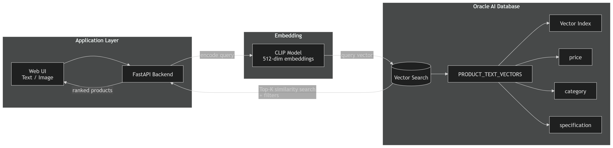
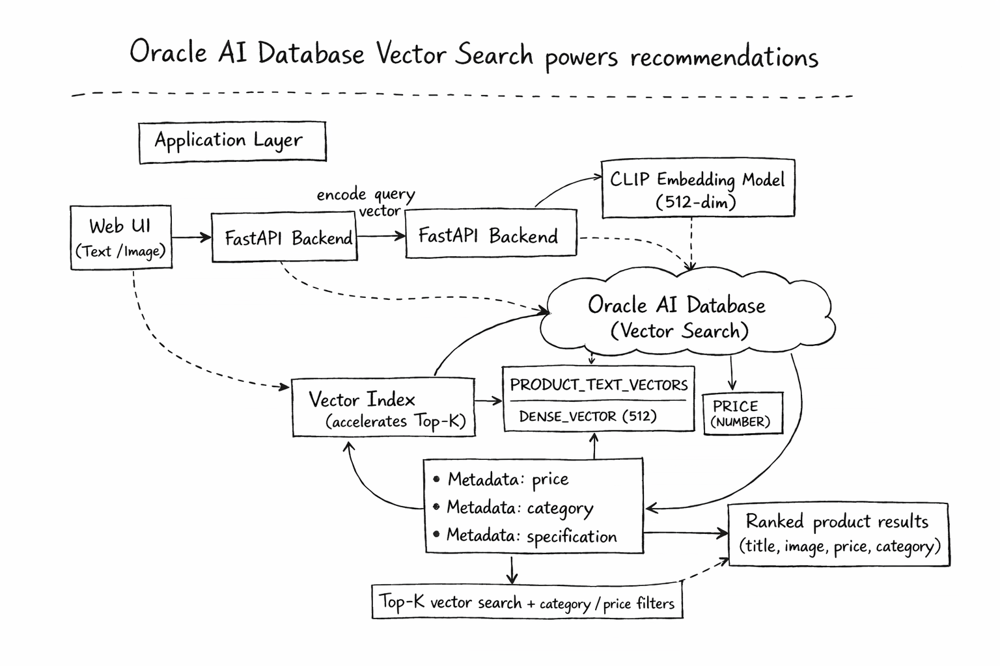
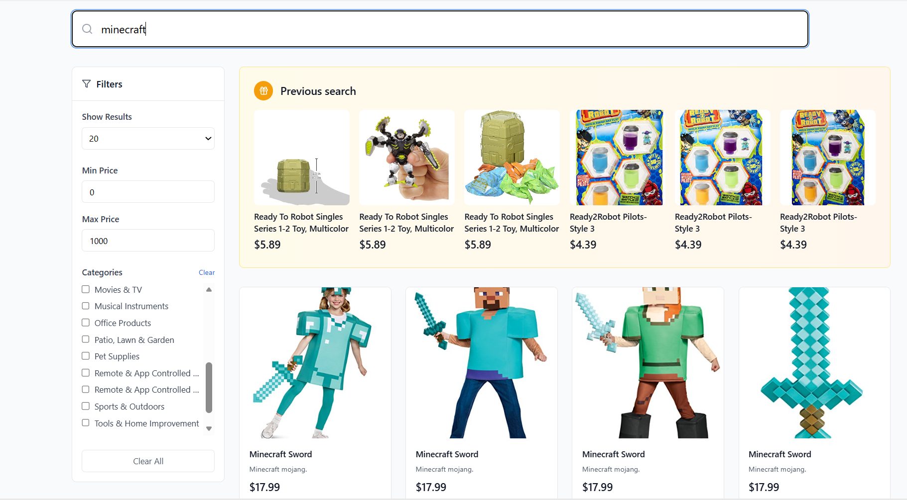
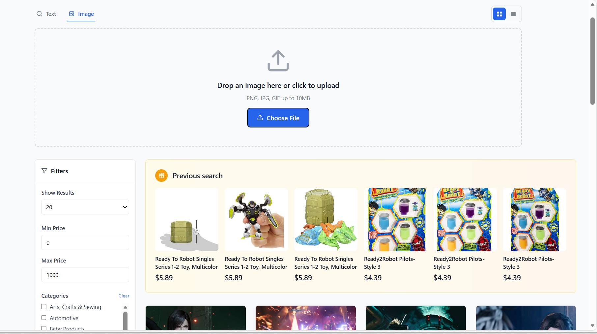
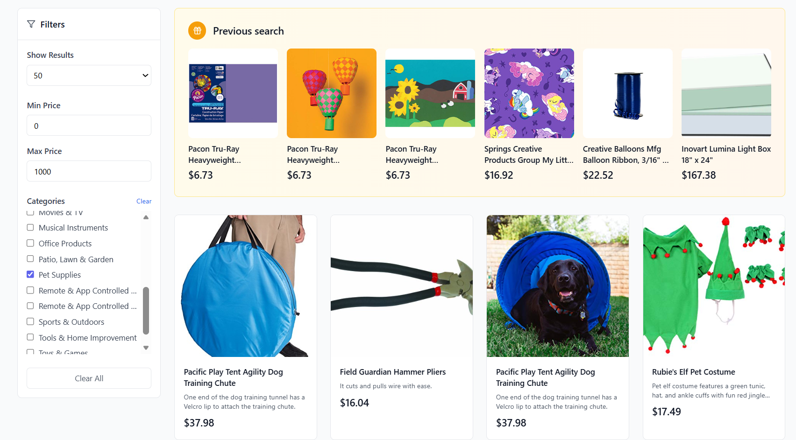
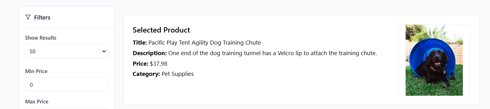

# 🛍️ Semantic Product Search and Visual Discovery with Oracle AI Database (Vector Search)

A **multimodal product search demo app** that shows how to build **semantic search and image-based similarity search** on top of **Oracle AI Database (Vector Search)**.

This project demonstrates an **end-to-end vector search pipeline** using CLIP embeddings, Oracle AI Database for similarity search, a FastAPI backend, and a web UI for text and image queries:
- 🧠 query embeddings for text and images
- ⚡ similarity search in Oracle AI Database (Vector Search)
- 🌐 REST API (FastAPI)
- 🖥️ Web UI for searching products (text / image / filters)

Built as **developer enablement content** and a demo for Oracle AI Database Vector Search, with support for both cloud and local development environments.

---

## ✨ What you can do with this app

- 🔎 Semantic text search (“find similar clothes”, “kids toys”, etc.)
- 🖼️ Image-based product search (visual similarity)
- 🎯 Vector similarity search in Oracle AI Database
- 🗂️ Filter by category & price
- 🧪 Local dev mode for demos & testing

---

## 🧠 High-Level Architecture


**Flow (end-to-end):**
1) The user submits a **text query** or **image** in the UI.  
2) The backend generates a **CLIP embedding (512-dim)** for the query.  
3) Oracle AI Database runs a **Top-K vector similarity search** (optionally combined with **category/price filters**).  
4) The backend returns ranked products (title, image, price, category) to the UI.
---
## 🧠 How Oracle Vector Search powers this app (end-to-end flow)



**What happens under the hood:**
1) The backend generates **CLIP embeddings (512-dim)** for both product data (ingestion) and user queries (runtime).  
2) At query time, Oracle runs a **Top-K similarity search** (optionally combined with **category/price filters**) and returns ranked results. 
3) Product vectors are stored in an Oracle VecDB table (default: **PRODUCT_TEXT_VECTORS**) together with product metadata used by the application. 
4) The backend returns UI-ready product objects (title, image URL, price, category) to the frontend.

> Result: “find products like this” works for both **semantic text** and **visual similarity**, not just keyword matching.


---
## 🖼️ UI Demo (Screenshots)

<table>
  <tr>
    <td align="center">
      <b>Text semantic search</b><br/>
      
    </td>
    <td align="center">
      <b>Image similarity search</b><br/>
      
    </td>
  </tr>
  <tr>
    <td align="center">
      <b>Category & price filters</b><br/>
      
    </td>
    <td align="center">
      <b>Product details</b><br/>
      
    </td>
  </tr>
</table>

---
## 🚀 Quickstart (Oracle AI Database)
1️⃣ Backend
```
cd backend
python -m venv .venv
source .venv/bin/activate
pip install -r requirements.txt

cp .env.example .env
# update VECDB_REST_URL and either VECDB_USERNAME/VECDB_PASSWORD or VECDB_ACCESS_TOKEN
# set VECDB_SELF_SIGNED_SSL=true only for a trusted self-signed development endpoint

python load_dataset.py
uvicorn main:app --host 0.0.0.0 --port 8000
```
2️⃣ Frontend
```
cd frontend
npm install
VITE_BACKEND_URL=http://<your_vm_ip_addrs>:8000 npm run dev -- --host 0.0.0.0 --port 5176
```
---
## ☁️ Cloud-first Deployment
This sample is designed to work well with Oracle AI Database environments and can be adapted for common deployment patterns such as:

- Oracle Autonomous Database
- Oracle AI Database (Vector Search enabled)

You can deploy:

- Backend on OCI Compute / container
- Database on Oracle AI Database or Autonomous Database
- Frontend on static hosting or local dev environment
---
## 🧪 Local Development Mode
For demos and local testing, you can also run against:

- Oracle AI Database Free (26ai Free)
- Local Docker / Podman Oracle AI DB container

This enables:

- local testing
- quick iteration
- reproducible demos

---
## 📂 Project Structure

```bash
product_recommendation/
├── backend/
│   ├── .env.example
│   ├── config.py
│   ├── load_dataset.py
│   ├── main.py
│   └── requirements.txt
├── frontend/
│   ├── src/
│   ├── package.json
│   └── vite.config.ts
├── images/
│   ├── architecture-high-level.png
│   ├── architecture-handdrawn.png
│   ├── ui-text-search.png
│   ├── ui-image-search.png
│   ├── ui-filters.png
│   └── ui-product-details.png
└── README.md
```    
## ⚙️ Configuration

Backend configuration is loaded from environment variables.

1. Copy `backend/.env.example` to `backend/.env`
2. Set:
   - `VECDB_REST_URL`
   - `VECDB_USERNAME`
   - `VECDB_PASSWORD`
   - optionally, `VECDB_ACCESS_TOKEN` (takes precedence over username/password)

Optional overrides include:
- `ORACLE_TEXT_TABLE`
- `ORACLE_DISTANCE_METRIC`

---
## 🤖 Embedding Model

- **Model**: `clip-ViT-B-32`
- **Library**: `sentence-transformers`
- **Source**: [Hugging Face – clip-ViT-B-32](https://huggingface.co/sentence-transformers/clip-ViT-B-32)

### 🔍 Example Usage:

```python
from sentence_transformers import SentenceTransformer

model = SentenceTransformer("clip-ViT-B-32")
```

> Used for **text** and **image** embeddings.

---

## 🔁 Indexing Pipeline

### 📚 Dataset

- **Name**: `ckandemir/amazon-products`
- **Fields Used**: `title`, `description`, `price`, `image_url`

### 🛠️ Workflow

1. Load dataset
2. Generate embeddings from title/description/image
3. Store in Oracle VecDB with metadata

---

## 🧪 Search Modes Supported

- **Text-based** semantic search
- **Image-based** similarity search  
- Both support **Top-K results** + optional **price filter**

---

## 📂 Upload Your Own Dataset (Optional)

If you want to use your own data:

### ✅ Supported Fields

- `Product Name`
- `Description`
- `Selling Price`
- `Category`
- `Product Specification`
- `Image`

### 📥 Steps:

1. Save your dataset as `.csv` or `.json`
2. Update `load_dataset.py` to read your file
3. Modify embedding logic as needed
4. Run `load_dataset.py` to index into Oracle VecDB

---

## 📓 Demo Notebook (Oracle AI Developer GitHub / Colab)

Related notebooks are available under **notebooks/vecdb/** for end-to-end Oracle VecDB workflows.

---
## 🧩 Technologies Used

- **Oracle AI Database (Vector Search)**
- **FastAPI**
- **CLIP embeddings (sentence-transformers)**
- **Python**
- **Vite frontend**
- **REST APIs**
---
## 🧑‍💻 Developer Enablement Goals

This sample is intended as developer enablement content for Oracle AI Database Vector Search use cases and multimodal search demos.

---

## 📄 API Details

Main backend endpoints include:
- `GET /products`
- `GET /categories`
- `POST /search`
- `POST /image-search`

---
