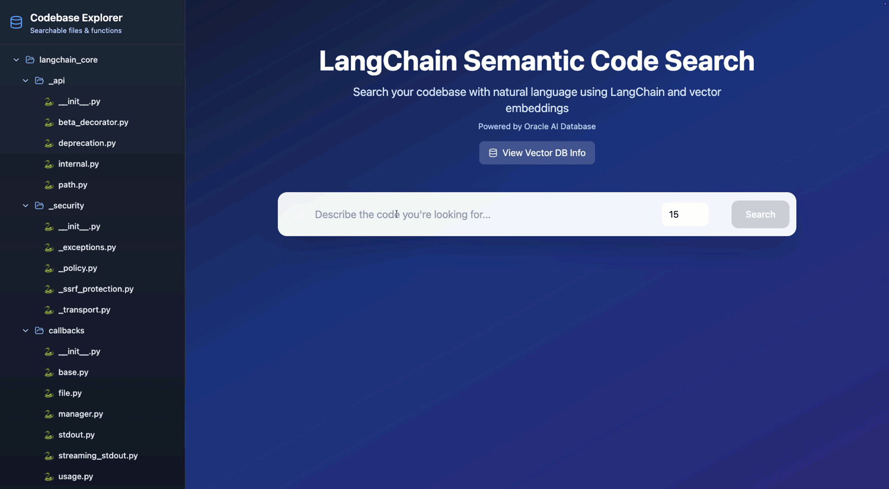
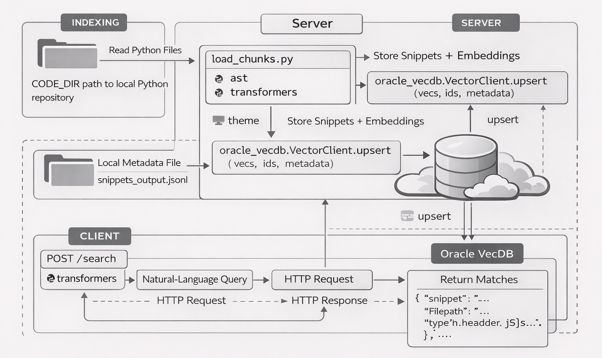
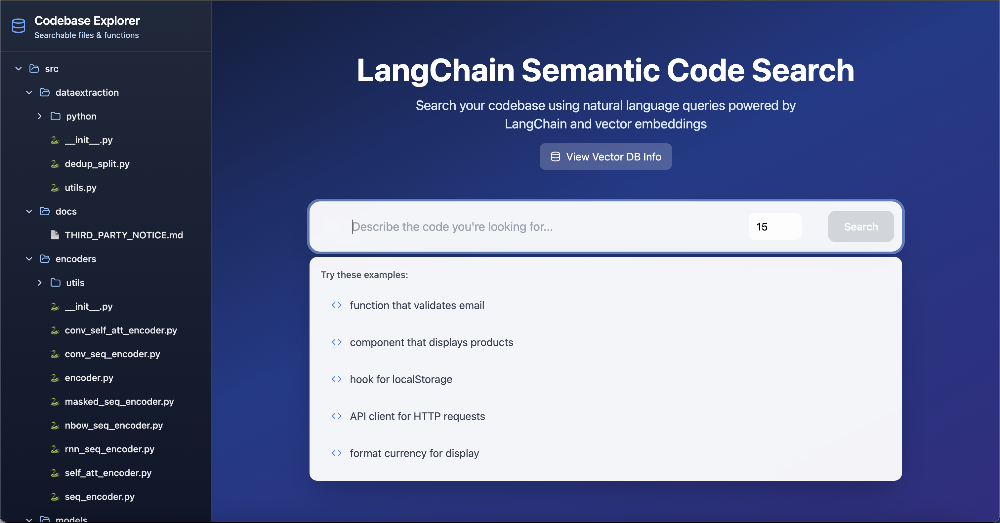

# LangChain Semantic Code Search | Natural-Language Code Retrieval with Oracle VecDB

A full-stack application for semantic code search over a local Python codebase, combining natural-language query understanding, Oracle VecDB retrieval, and interactive file exploration.

## 🚀 Overview

- Displays a navigable file tree of your repository.
- On search matches, reveals function snippets and surrounding context with a "Reveal" button.
- Built with a FastAPI backend (Python), Jina embeddings, and a React + TailwindCSS frontend.
- Vector search is powered by the **Oracle VecDB Python SDK** backed by Oracle Database vector tables.

Oracle VecDB acts as the retrieval layer of the application. Parsed code snippets are embedded with a code-aware Jina model, stored as dense vectors together with metadata, and queried at runtime using natural-language search to return relevant functions, classes, and code context.

---

## What you can do with this app

- Search a local Python codebase using natural-language queries
- Retrieve relevant functions, classes, and code blocks through Oracle VecDB similarity search
- Browse repository files and inspect source code interactively
- Reveal contextual lines around matching snippets
- Explore how code embeddings and vector search can support developer productivity workflows

## 

## 🧩 Features

- **Natural-language code search**: Search a local Python codebase using descriptive queries
- **Oracle VecDB integration**: Store and retrieve code embeddings with similarity search
- **Interactive file explorer**: Browse repository files and inspect source code from the UI
- **Context-aware snippet viewer**: Reveal surrounding lines around matched code snippets
- **Top-K retrieval**: Control the number of returned search results
- **Code-aware embeddings**: Use `jinaai/jina-embeddings-v2-base-code` for semantic code understanding
- **React + FastAPI architecture**: Lightweight frontend and backend stack for developer-facing search workflows

---

## 🧭 Architecture Flow

1. The indexing pipeline reads the target Python codebase from `CODE_DIR`.
2. Python files are parsed with `ast` and split into meaningful snippets such as functions, classes, and control-flow blocks.
3. Each snippet is saved with metadata such as file path, snippet type, and line range.
4. Code embeddings are generated using the Jina code embedding model.
5. Snippet vectors and metadata are uploaded into Oracle VecDB.
6. At query time, the user enters a natural-language description of the code they are looking for.
7. Oracle VecDB performs top-k similarity search over the indexed code snippets.
8. The backend returns matched code snippets, metadata, and optional surrounding context for frontend display.

<p align="center">
  
</p>
<p align="center"><em>Semantic code search architecture with AST-based snippet extraction, Jina embeddings, Oracle VecDB retrieval, and interactive code exploration.</em></p>

---

## Why Oracle VecDB in this sample

This sample uses Oracle VecDB as the retrieval backbone for semantic code search. Code snippets are embedded and stored as dense vectors together with metadata, enabling natural-language retrieval over local source files while preserving useful developer context such as file paths, snippet types, and line numbers.

---

## Pre-Installation

Before indexing a codebase, make sure you have a local Python repository available. You can use the LangChain repository as an example, or any other repository of your choice that contains Python files.

```bash
git clone https://github.com/langchain-ai/langchain.git
```

---

## Configuration

Oracle VecDB connection details live in `config.py` and are loaded from environment variables.

---

### VecDB environment variables

1. Copy `backend/.env.example` to `backend/.env`.
2. Replace the placeholder `VECDB_REST_URL`, `VECDB_USERNAME`, and `VECDB_PASSWORD` values with your actual VecDB endpoint and credentials.
3. Keep `backend/.env` out of source control.

`config.py` reads these values automatically:

```python
from dotenv import load_dotenv
load_dotenv(override=True)

ORACLE_VECDB_REST_URL = os.getenv("VECDB_REST_URL")
ORACLE_VECDB_USERNAME = os.getenv("VECDB_USERNAME")
ORACLE_VECDB_PASSWORD = os.getenv("VECDB_PASSWORD")
ORACLE_VECDB_ACCESS_TOKEN = os.getenv("VECDB_ACCESS_TOKEN")
```

You can still override other settings via environment variables, such as `ORACLE_TABLE_NAME`.

---

## Installation

### Backend Setup (FastAPI + Oracle VecDB)

**Requirement:** Ensure you have Python **3.10+** installed on your machine.

```bash
python3 -m venv .venv
source .venv/bin/activate
pip install -r requirements.txt
```

Before running the backend, do the following:

1. Navigate to where the LangChain repository had been cloned. This repository contains the codebase through which the app will search.
2. Navigate to the `libs/core/langchain_core` directory inside the cloned repository:

```bash
cd langchain/libs/core/langchain_core
```

3. Copy the absolute path to the `langchain_core` folder.
4. **Set the `CODE_DIR` path** in your `.env` file:

Create or edit the `.env` file in the `backend` folder of your project and add the following line:

```env
CODE_DIR=/absolute/path/to/langchain/libs/core/langchain_core
```

Replace with the path that you copied.

5. Ensure you have `python-dotenv` installed (already included in the backend requirements).
6. Run `load_chunks.py` to chunk and upsert the codebase into Oracle VecDB. NOTE: This may take a few minutes to complete and requires access to the configured Oracle VecDB endpoint.

---

### Frontend Setup (React)

```bash
cd frontend
npm install
```

---

## Running the Application

### Launch Backend (FastAPI)

```bash
uvicorn main:app --host 0.0.0.0 --port 8000
```

Ensure that the Oracle VecDB connection values are correctly set in your environment variables or in `config.py`.

### Launch Frontend (React)

```bash
VITE_API_BASE=http://<vm_ip_addrs>:8000 npm run dev -- --host 0.0.0.0 --port 5178
```

The frontend will run at: `http://<vm_ip_addrs>:5178`

---

## Quickstart

```bash
python3 -m venv .venv
source .venv/bin/activate
pip install -r requirements.txt
python load_chunks.py
uvicorn main:app --host 0.0.0.0 --port 8000
```

---

## Project Structure

```text
semantic_code_search/
├── backend/
│   ├── .env.example
│   ├── config.py
│   ├── load_chunks.py
│   ├── main.py
│   └── requirements.txt
├── frontend/
│   ├── src/
│   │   ├── components/
│   │   ├── App.tsx
│   │   ├── SearchInterface.tsx
│   │   ├── CodeViewer.tsx
│   │   └── VectorDBInfo.tsx
│   └── package.json
├── images/
│   └── screenshot.png
└── README.md
```

---

## Vector Database Configuration (Oracle VecDB)

- **Service Provider**: Oracle VecDB (Oracle AI Database vector tables)
- **Purpose**: Stores and retrieves embeddings using similarity search
- **Similarity Metric**: Controlled via Oracle VecDB table index parameters (defaults to cosine)
- **Default table**: `LANGCHAIN_CODE_SEARCH`
- **Vector dimension**: `768`

---

## Stored Metadata

Each indexed code snippet stores metadata such as:

- `context_snippet_type`
- `context_name`
- `context_file_name`
- `context_file_path`
- `line_from`
- `line_to`

This metadata allows the frontend to present search results together with file locations and surrounding code context.

---

## Embedding Model & Vector Integration

- **Embedding Model**: [`jinaai/jina-embeddings-v2-base-code`](https://huggingface.co/jinaai/jina-embeddings-v2-base-code)
  - Multilingual transformer model fine-tuned for source code understanding.
  - Supports 30+ programming languages and large context lengths.
  - Hosted on Hugging Face and integrated using the `transformers` library.

- **Integration**:
  - Embedding code/document chunks using the Jina model.
  - Upserting vectors and metadata directly into Oracle VecDB using the `oracle-vecdb` SDK.
  - Performing similarity queries via Oracle VecDB’s `query_vectors` endpoint.

---

## Indexing Pipeline

### Parsed Snippet File

- **File Name**: `snippets_output-new.jsonl`
- **Format**: JSON Lines, each line contains a parsed Python code snippet

### Relevant Fields

- `context_code`: The extracted code snippet
- `context_file_name`: File name from which the snippet was extracted
- `context_file_path`: Relative file path of the snippet
- `context_name`: Name of the function/class/structure (or `<anonymous>`)
- `context_snippet_type`: AST node type (`FunctionDef`, `ClassDef`, `If`, etc.)
- `line_from`: Starting line number of the snippet
- `line_to`: Ending line number of the snippet
- `id`: Unique identifier

### Workflow

1. Traverse the Python codebase recursively and identify all `.py` files.
2. Parse each Python file using `ast` and extract semantically meaningful code snippets (functions, classes, if-blocks, etc.).
3. Store these snippets with metadata in a `.jsonl` file.
4. Generate vector embeddings using the `jinaai/jina-embeddings-v2-base-code` model.
5. Upsert embeddings and metadata into Oracle VecDB using the `oracle_vecdb` SDK.
6. Enable similarity-based search by querying Oracle VecDB directly from the FastAPI backend.

---

## Query Flow

1. The user submits a natural-language query from the frontend.
2. The backend generates a query embedding using the Jina code embedding model.
3. Oracle VecDB performs top-k similarity search over indexed code snippets.
4. Matching snippets are returned together with metadata and optional surrounding context.
5. The frontend renders results and allows the user to inspect file contents and reveal additional lines.

---

## 🖼️ UI Image

<p align="center">
  
</p>
<p align="center"><em>Semantic code search UI with natural-language query input, top-k retrieval, vector DB info, and interactive file browsing.</em></p>

---

## Current Limitations

- The current indexing flow targets Python codebases only
- Search quality depends on snippet extraction quality and embedding quality
- The backend requires local access to the indexed repository through `CODE_DIR`
- Code indexing may take time for larger repositories

---

## Developer Enablement Context

This sample is designed to demonstrate how Oracle VecDB can support semantic retrieval over source code, combining code embeddings, metadata-aware indexing, and natural-language developer search workflows in an end-to-end application.
