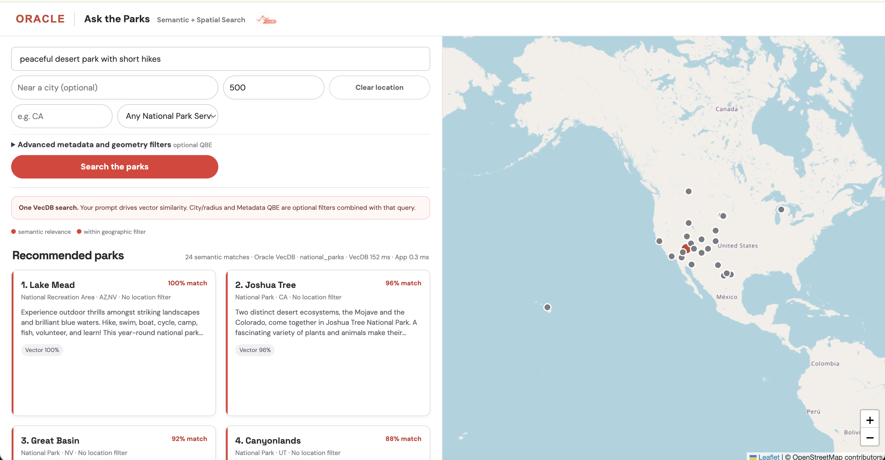
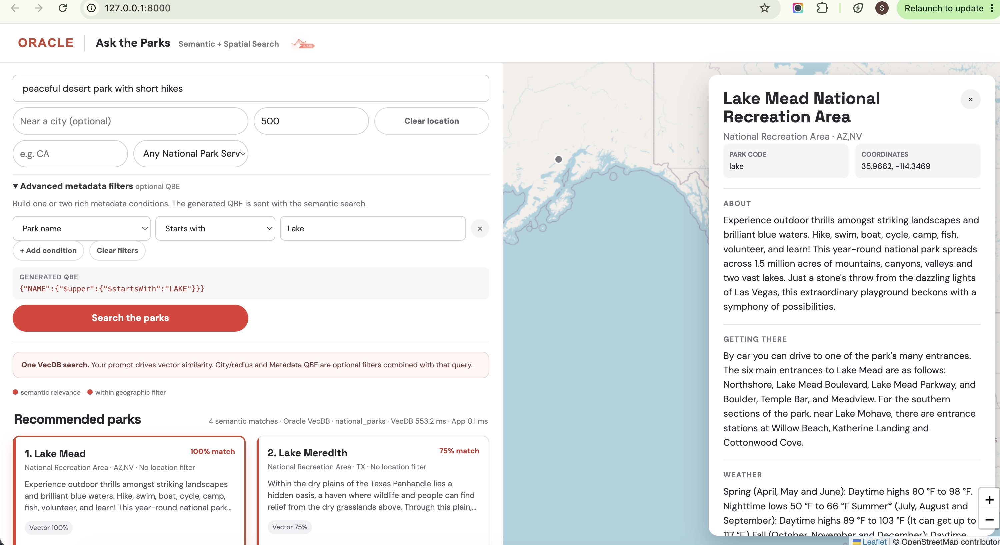
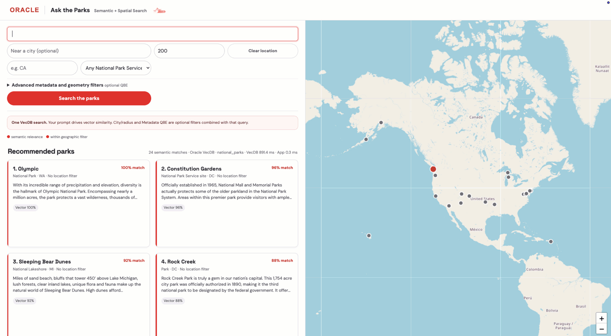

# Ask the Parks

A Python demo for showing VecDB semantic search with optional GeoJSON and metadata QBE filters on the National Park Service dataset.

## Screenshots

Semantic map search links ranked park cards, map markers, and the full park-details drawer.



The advanced filter panel shows the generated QBE alongside the filtered map and park results.



## What the app does

Ask the Parks is a map-and-list explorer for demonstrating Oracle VecDB with a real spatial dataset. A natural-language prompt, such as `waterfall hikes` or `peaceful desert park with short hikes`, is always sent as a semantic VecDB query. Location is optional: entering a city applies a GeoJSON `$near` radius filter; clearing the location returns to a nationwide semantic search. The Advanced metadata panel builds QBE filters for rich CSV fields without asking users to write JSON.


The interface is designed for a live demo:

- Results appear as linked cards and map markers; selecting either highlights the other.
- Clicking an empty map location searches again around that point. **Clear location** removes the spatial filter.
- Selecting a park opens its complete metadata record, fetched with `list_vectors()`.
- The result summary separates the VecDB `query()` time from application-side processing time.
- The metadata builder supports up to two conditions across park name/code, designation, state, description, directions, and weather. It supports contains, starts with, exact, and regex matching, and reveals the generated QBE for developers.

When VecDB is not configured, the app remains runnable using a local CSV/vector fallback. This is useful for UI development, but raw Metadata QBE is applied only when connected to Oracle VecDB.

Run the UI from the app directory:

```bash
cd apps/vecdb/vecdb_ask_parks
python3 app.py
```

Then open `http://127.0.0.1:8000`.

## Connect Oracle VecDB

The app starts in a local CSV fallback mode. To use Oracle VecDB, copy `.env.example` to `.env` and configure these variables (or export them before starting it):

```bash
export VECDB_REST_URL="https://<host>:<port>/ords/<schema>/_/db-api/stable/vecdb/"
export VECDB_ACCESS_TOKEN="<bearer-token>"
export VECDB_TABLE="national_parks"
python3 app.py
```

Alternatively, set `VECDB_USERNAME` and `VECDB_PASSWORD` instead of `VECDB_ACCESS_TOKEN`. Bearer-token authentication takes precedence when both are set. TLS verification is enabled by default; set `VECDB_SELF_SIGNED_SSL=true` only for a development endpoint with an internal or otherwise untrusted certificate.

When configured, the app calls `OracleVecDB.query()` with a hosted text query and reports the VecDB call time separately from application-side response processing. A city/radius adds a QBE GeoJSON `$near` filter on `metadata.location`; leaving it blank, or using **Clear location**, runs semantic search across all parks. The Advanced metadata panel generates an optional JSON filter directly for VecDB. It covers `PARK_CODE`, `NAME`, `DESIGNATION`, `STATES`, `DESCRIPTION`, `DIRECTIONS_INFO`, and `WEATHER_INFO`; two completed conditions are combined with `$and`.

For example:

```json
{ "PARK_CODE": "yose" }
```

The builder's **Contains** option uses a generated `$regex` expression. Its **Matches regex** option accepts a regex pattern directly; for example, filtering Park name with `.*Adams.*` generates:

```json
{ "NAME": { "$regex": ".*Adams.*" } }
```

The configured table must contain the park metadata, including `location: {"type":"Point","coordinates":[longitude,latitude]}`. If no VecDB variables are set, the supplied dense vectors are used for local cosine ranking and GeoJSON radius filtering; custom Metadata QBE requires an Oracle VecDB connection.

## Create and load the parks table

`load_parks_vecdb.py` creates a text-queryable VecDB table and upserts the supplied dense vectors in batches. The QBE-ready CSV is included with this app, so use it as the default data source.

Before starting the UI for the first time, run this from the app directory to create and populate `VECDB_TABLE` from the bundled dataset:

```bash
cd apps/vecdb/vecdb_ask_parks
python3 load_parks_vecdb.py --csv-file data/us_national_parks_dataset_spatial.csv
```

Without this setup step, the UI can connect to VecDB but its search requests will fail because the configured table does not exist.

```bash
export VECDB_REST_URL="https://<host>:<port>/ords/<schema>/_/db-api/stable/vecdb/"
export VECDB_ACCESS_TOKEN="<bearer-token>"
export VECDB_TABLE="national_parks"
export VECDB_EMBED_MODEL="all_MiniLM_L12_v2"
python3 load_parks_vecdb.py --csv-file data/us_national_parks_dataset_spatial.csv
```

The embedding model must already be available in your VecDB service and must match the model used to produce the CSV vectors. The provided data contains 384-dimension vectors; `all_MiniLM_L12_v2` is the default assumption and can be overridden with `VECDB_EMBED_MODEL` or `--embed-model`.

The script does not drop an existing table by default. To deliberately replace it, run:

```bash
python3 load_parks_vecdb.py --recreate
```

To load a dataset from a URL instead, set `PARKS_CSV_URL` in `.env` or pass `--csv-url`. Use `--skip-create` only after a failed run that already created the table.

## GeoJSON location QBE in the UI

Open **Advanced metadata and geometry filters** in the UI. **Near city or map point** uses `$near` with the city/map coordinates and radius. Select **Within GeoJSON geometry** or **Intersects GeoJSON geometry** to paste a GeoJSON geometry; it is shown in **Generated QBE** and sent with the semantic query.

The metadata controls also support `$in`, `$nin`, `$ne`, and `$exists`; choose **Match all conditions** or **Match any condition** to generate `$and` or `$or`. Separate values with commas for **Is one of** and **Is not one of**.

For example, use this small San Francisco Bay Area polygon to verify either `$within` or `$intersects`:

```json
{
  "type": "Polygon",
  "coordinates": [
    [
      [-123.2, 37.2],
      [-121.7, 37.2],
      [-121.7, 38.3],
      [-123.2, 38.3],
      [-123.2, 37.2]
    ]
  ]
}
```

## Developer notebook

[ask_the_parks_vecdb.ipynb](ask_the_parks_vecdb.ipynb) is an executable walkthrough of the client configuration, table inspection, timed semantic `query()`, optional spatial GeoJSON QBE, combined metadata/spatial filters, and `list_vectors()` for the details drawer. Its create-and-load cell is disabled by default.
